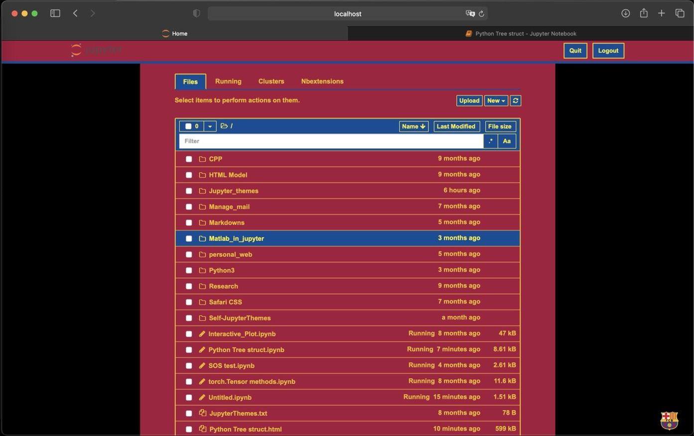
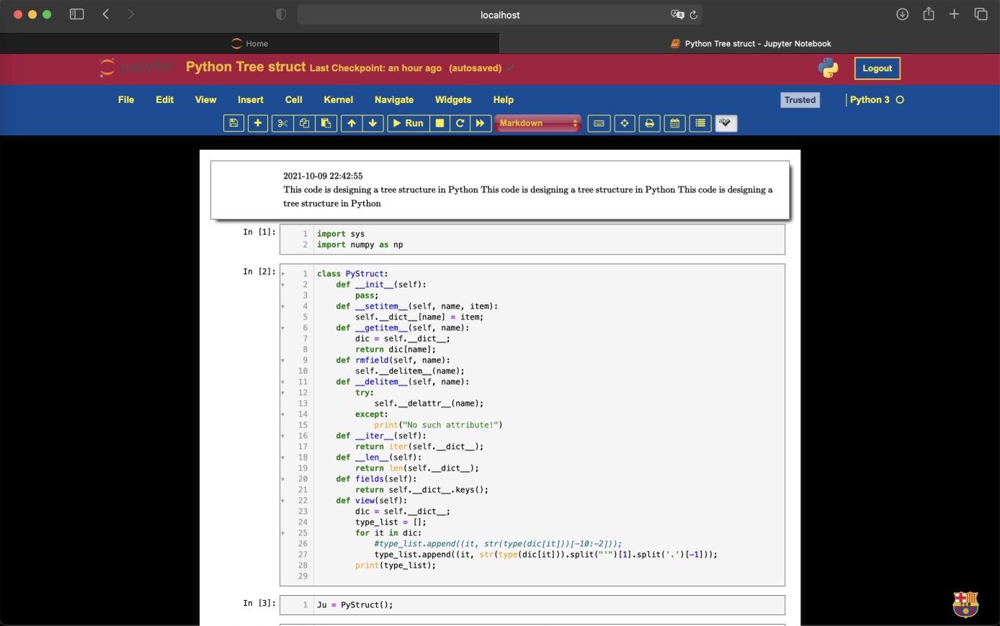
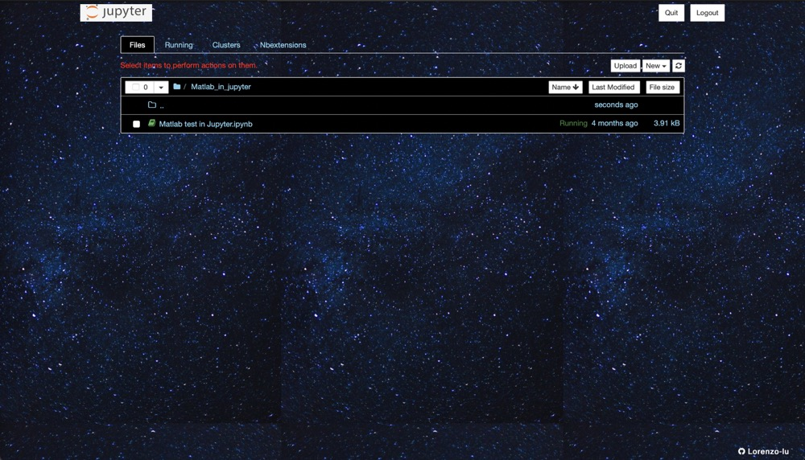
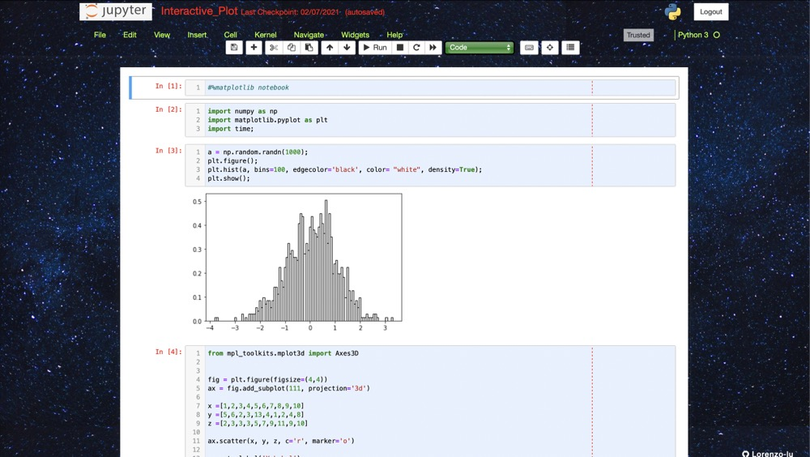

# Jupyter Themes
This project provides some special jupyter themes.

## New version:
What's new?

* Adding soccer themes:
* TeX font in markdown



* Use Python parse arguments to change themes (faster!)

To change the themes:
* git clone this repo
* go to **console** folder
* in terminal, run `python3 console.py -t Barcelona`

The other arguments that you can try are:
* `-t`: 
  * `default` (the default jupyter notebook style)
  * `Tiger`
  * `Cosmo`
  * `Bayern`
  * `Dortmund`
  * `Real_Madrid`
  * `Barcelona`
  * `AC_Milan`
  * `Inter_Milan`  

If there is no `-t` argument, it will keep the most recent style

* `-cs`: code size. By default, it is `11px`
* `-clh`: code line height. By default, it is `140%`
* `-ms`: markdown size. By default, it is `13px`
* `-mlh`: markdown line height. By default, it is `150%`
* `-rs`: reset style. If set as `true`, all the missing arguments will be the default.

For example, you firstly tried `python3 console.py -t Barcelona -cs 14px` and you want to increase the code font size, just run `python3 console.py -cs 15px` and don't have to worry about the other stuff. But if you run `python3 console.py -rs true -cs 15px`, your code size will be larger, but your theme will be reset to default.


<!--
* download this repo
* open the <b>console</b> folder and open <b>console.py</b>
*  ```PATH``` is the pathname from step 2 (if the automatic process just works, just skip it), ```code_size``` modifies how large your codes and outputs are, ```code_inline_height``` modifies your codes inline height. ```markdown_size``` and ```markdown_line_height``` do the same operations to markdowns; 
* Run in terminal ```bash console.sh```. If you don't want to lose your previous style, move your original 'custom' folder from '.jupyter' to somewhere else in advance!
* If you see `No such file or directory:...`, run `jupyter-notebook --generate-config` and redo the last step;
* Enjoy it!
* -->


## Previews
---
### Tiger theme
Catalog:

Notebook:


### Cosmo theme
Catalog:

Notebook:


---

