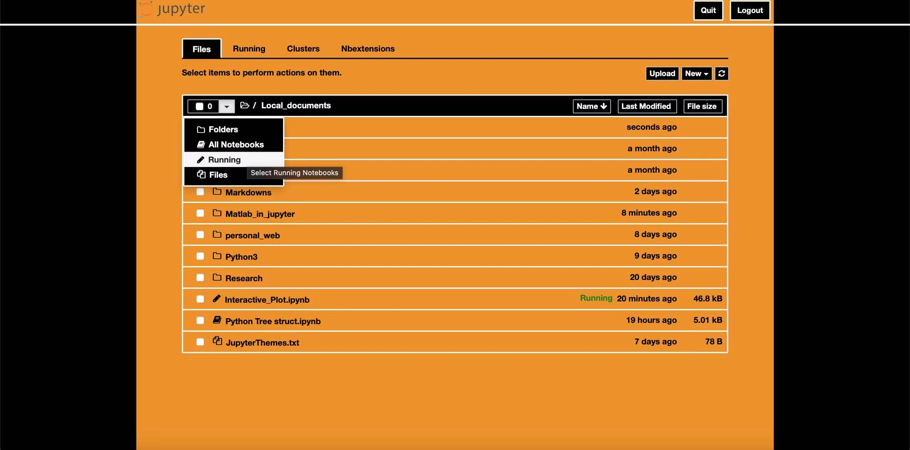
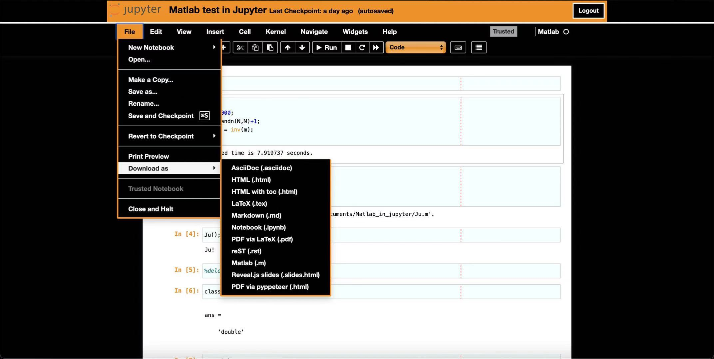

# Jupyter Themes

This project provides some special jupyter themes. You can:

1. download this repo
2. find your <b>.jupyter</b> directory
3. move the <b>custom</b> directory from the downloaded file to your <b>.jupyter</b> directory (replace it if you already have a custom folder). 
4. Enjoy it!

## Previews
---
### Pxxnhub theme
Catalog:

Notebook:

---