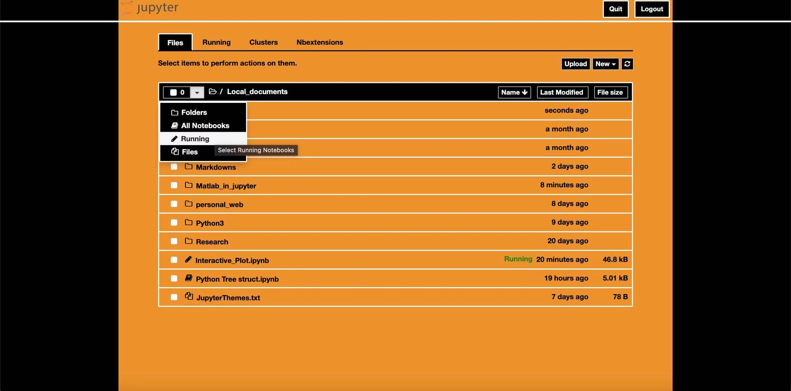
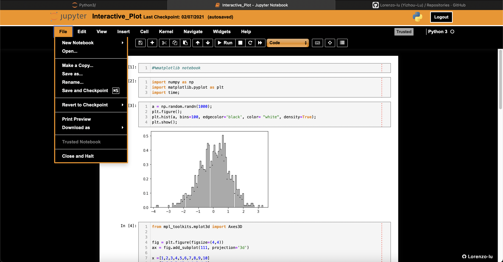

# Jupyter Themes

This project provides some special jupyter themes. You can:

1. download this repo
2. find your <b>.jupyter</b> directory
3. open the console: ```PATH``` is the pathname from 2, ```code_size``` modifies how large your codes and outputs are, ```code_inline_height``` modifies your codes inline height. ```markdown_size``` and ```markdown_line_height``` do the same operations to markdowns; 
4. Run the codes. If you don't want to lose your previous style, move your original 'custom' folder from '.jupyter' in advance!
5. Enjoy it!


## Previews
---
### PH theme
Catalog:

Notebook:


---